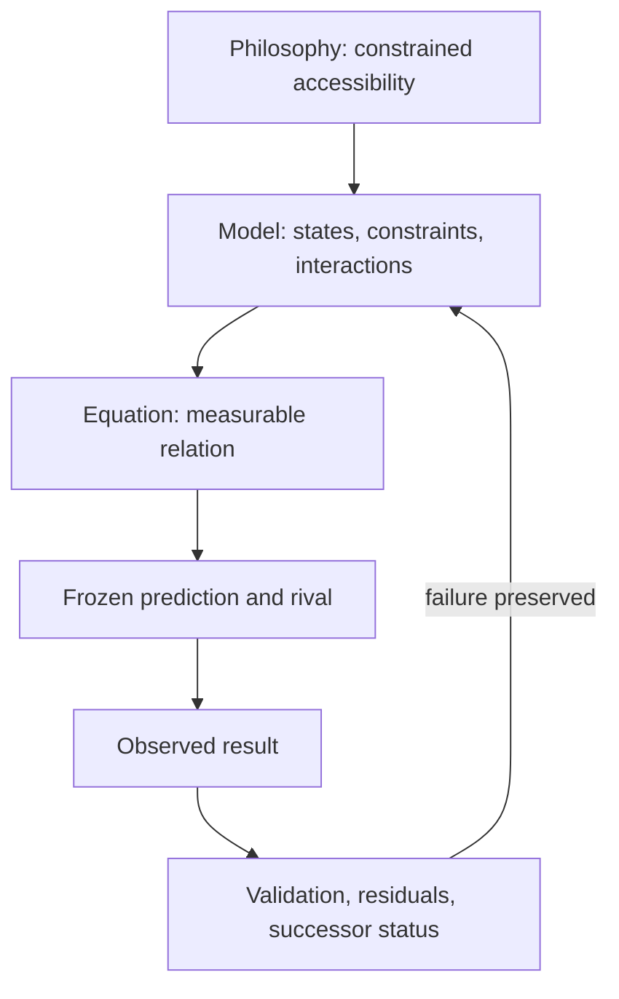

# From Philosophy to Observable Test

DT begins with a philosophical proposal:

> What persists is not merely what exists, but what remains accessible to continued interaction under constraints.

That proposal is translated into quantities, then into predictions, then into observations. Each translation can fail independently.

## Core translation

A candidate constraint measure is:

[
C=1-\frac{P_f}{P_0}.
]

If (P_0) is accessible possibility before a constraint and (P_f) afterward, larger (C) means a greater measured restriction. This is a defined comparison, not proof that every real constraint follows DT.

A proposed information-like form is:

[
\Delta C=-\Delta\ln\Omega_{accessible}.
]

The expected input is therefore not a story alone. It is a defined state space, a before-and-after accessibility measure, the intervention or history that changed it, and uncertainty about both measurements.

## Persistence story

Two systems can end in the same visible state yet respond differently later because their histories changed what remains accessible. DT represents this with effective interaction and accumulated persistence:

[
I_{eff}=ICK,qquad \int ICK\,dt\ge P_c.
]

A useful test must supply interaction (I), constraint (C), coupling (K), duration, threshold (P_c), matched terminal states, and a later probe. The observable is a reproducible difference after the matched state—not merely a compelling narrative.

## Reading rule

Every visual and application should show:

1. the human-language observation;
2. the equation derived from it;
3. the inputs a person must provide;
4. the predicted output;
5. the rival explanation and failure condition;
6. the current scientific-status label.
