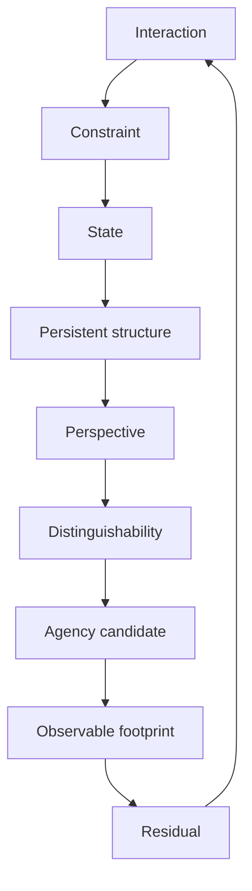
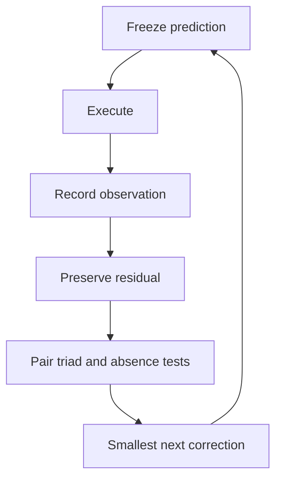

# Visual Index

GitHub-rendered Mermaid diagrams are used for exact conceptual topology. Future illustrated guides should draw from Thomas Cutler's memoir, reflections, family explanations, and creative writing without exposing private people or records.

## DT causal spine

## Recursive testing loop

Visuals explain relationships; they do not increase a claim's evidentiary status.